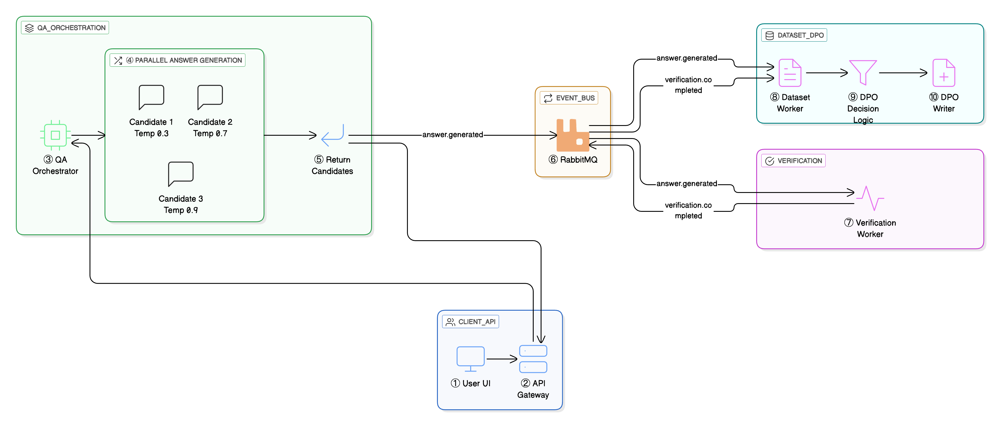
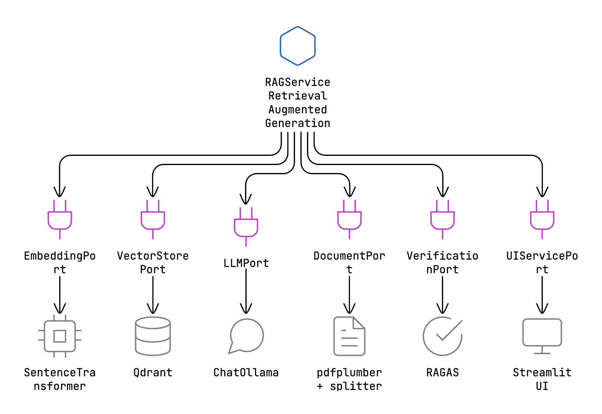

# RLVR Automation - Reinforcement Learning with Verifiable Rewards

An event-driven microservices system for automated DPO (Direct Preference Optimization) dataset generation from RAG (Retrieval-Augmented Generation) responses. The system generates multiple answer candidates, verifies their quality, and automatically creates preference pairs for LLM fine-tuning.

## 🚀 Quick Start

### RunPod (Recommended - GPU Accelerated)

```bash
# 1. Clone the repository
git clone <your-repo-url>
cd rlvr-automation

# 2. Start all services
./runpod-start-relaxed-thresholds.sh

# 3. Access the UI
# Open http://<your-runpod-url>:8501 in your browser
```

### Local Development

```bash
cd infrastructure
docker-compose up -d  # Start all microservices
# Access UI: http://localhost:8501
```

## ✨ Key Features

### 🎯 Automated DPO Dataset Generation

- **Multi-candidate generation**: Generates 3 answer candidates per question with different temperatures
- **Automatic verification**: RAGAS-based quality scoring (faithfulness & relevancy)
- **Preference pair creation**: Automatically creates chosen/rejected pairs for DPO training
- **Quality filtering**: Configurable thresholds for score differences and minimum quality

### 🔍 Request Tracing & Observability

- **Correlation ID tracking**: Trace requests from UI → API Gateway → QA Orchestrator → Workers
- **Event-driven architecture**: RabbitMQ-based async processing with full event logging
- **Real-time monitoring**: Scripts to trace request lifecycle and monitor DPO pair creation

### 🏗️ Microservices Architecture

- **API Gateway**: Request routing and correlation ID generation
- **QA Orchestrator**: Multi-candidate answer generation with RAG
- **Verification Worker**: Quality scoring using RAGAS metrics
- **Dataset Worker**: DPO pair aggregation and dataset creation
- **Document Ingestion**: PDF processing and vector storage

### 📚 RAG Capabilities

- Multi-PDF upload and ingestion
- Configurable chunking and retrieval (chunk size/overlap, top-k)
- Llama 3.2 via Ollama + sentence-transformers embeddings
- Qdrant vector database for semantic search
- WhatsApp-themed Streamlit chat UI with source citations

## 📖 Usage

### 1. Upload Documents

```bash
# Use the Streamlit UI to upload PDFs
# Or use the document ingestion API
curl -X POST http://localhost:8003/ingest \
  -F "file=@document.pdf" \
  -F "collection_name=my_docs"
```

### 2. Ask Questions (Multi-Candidate Mode)

```bash
# Via API (generates 3 candidates + DPO pairs)
curl -X POST http://localhost:8001/api/ask/multi-candidate \
  -H 'Content-Type: application/json' \
  -d '{"question": "What is AWS Lambda?", "num_candidates": 3}'

# Response includes correlation_id for tracing
{
  "correlation_id": "abc-123-def",
  "batch_id": "xyz-789",
  "candidates": [...]
}
```

### 3. Trace Request Lifecycle

```bash
# Trace a specific request through the entire system
./trace-request.sh <correlation-id>

# Output shows:
# - API Gateway logs
# - QA Orchestrator processing
# - Answer generation events
# - Verification events
# - DPO pair creation
```

### 4. View Generated DPO Pairs

```bash
# Pretty print DPO pairs
./pretty-print-dpo.sh

# View pairs for specific request
./pretty-print-dpo.sh <correlation-id>

# DPO files location
ls -lh /workspace/data/dpo_data_*.jsonl
```

## ⚙️ Configuration

### Environment Variables

**RAG Configuration:**

- `CHUNK_SIZE`, `CHUNK_OVERLAP`, `TOP_K_RESULTS` - Document chunking and retrieval
- `QDRANT_URL`, `QDRANT_API_KEY` - Vector database connection
- `OLLAMA_URL`, `OLLAMA_MODEL` - LLM endpoint and model

**DPO Thresholds:**

- `MIN_SCORE_DIFF=0.05` - Minimum score difference between chosen/rejected
- `MIN_CHOSEN_SCORE=0.6` - Minimum quality score for chosen answer
- `ENABLE_QUALITY_FILTER=false` - Enable/disable quality filtering

**Worker Configuration:**

- `VERIFICATION_MODE=heuristic` - Verification mode (heuristic/ollama)
- `RABBITMQ_URL` - Event bus connection
- `LOG_LEVEL` - Logging verbosity

## 📁 Project Structure

```
rlvr-automation/
├── services/                           # Microservices
│   ├── api-gateway/                    # Request routing, correlation ID generation
│   │   ├── src/main.py
│   │   └── Dockerfile
│   ├── qa-orchestrator/                # Multi-candidate answer generation
│   │   ├── src/main.py                 # RAG + event publishing
│   │   └── Dockerfile
│   ├── document-ingestion/             # PDF processing & vector storage
│   │   ├── src/main.py
│   │   └── Dockerfile
│   └── ...
│
├── workers/                            # Background event processors
│   ├── verification-worker/            # Quality scoring (RAGAS)
│   │   ├── src/worker.py
│   │   ├── src/ragas_verifier.py
│   │   └── Dockerfile
│   └── dataset-generation-worker/      # DPO pair creation
│       ├── src/worker.py
│       ├── src/event_aggregator.py
│       └── Dockerfile
│
├── shared/                             # Shared libraries
│   ├── events/                         # Event schemas & pub/sub
│   │   ├── schemas.py                  # Pydantic event models
│   │   ├── publisher.py                # RabbitMQ publisher
│   │   └── consumer.py                 # RabbitMQ consumer
│   └── logging_config.py               # Structured logging
│
├── ui/streamlit/                       # Streamlit UI
│   ├── app.py
│   └── Dockerfile
│
├── infrastructure/                     # Deployment configs
│   ├── docker-compose.yml              # Local development
│   └── kubernetes/                     # K8s manifests (future)
│
├── data/                               # Generated datasets
│   ├── dpo_data_YYYYMM.jsonl          # DPO training pairs
│   └── training_data_YYYYMM.jsonl     # Raw training data
│
├── logs/                               # Service logs
│   ├── api-gateway.log
│   ├── qa-orchestrator.log
│   ├── verification-worker.log
│   └── dataset-worker.log
│
├── scripts/                            # Utility scripts
│   ├── trace-request.sh                # Trace request by correlation_id
│   ├── pretty-print-dpo.sh             # View DPO pairs
│   └── runpod-start-relaxed-thresholds.sh  # RunPod startup
│
└── docs/                               # Documentation
    ├── architecture.md
    └── DEPLOYMENT_GUIDE.md
```

## 🚀 How It Works

### Event-Driven Architecture



### DPO Pair Creation Logic

1. **Generate 3 candidates** with temperatures: 0.3 (conservative), 0.7 (balanced), 0.9 (creative)
2. **Score each candidate** using RAGAS (faithfulness + relevancy)
3. **Select best and worst** based on scores
4. **Check thresholds**:
   - Score difference >= `MIN_SCORE_DIFF` (default: 0.05)
   - Chosen score >= `MIN_CHOSEN_SCORE` (default: 0.6)
5. **Create DPO pair**:
   ```json
   {
     "prompt": "What is AWS Lambda?",
     "chosen": "AWS Lambda is a serverless compute service...",
     "rejected": "Lambda is a function...",
     "metadata": {
       "correlation_id": "abc-123",
       "chosen_score": 0.85,
       "rejected_score": 0.62,
       "score_difference": 0.23
     }
   }
   ```

## 🏗️ Deployment Options

### ☁️ RunPod (Recommended - GPU Accelerated)

```bash
# 1. Create RunPod pod with PyTorch template
# 2. Clone repository
git clone <your-repo-url>
cd rlvr-automation

# 3. Start all services
./runpod-start-relaxed-thresholds.sh

# 4. Access UI
# http://<runpod-url>:8501
```

**Performance:** 5x faster than CPU (2-5s vs 20-25s per answer)

### 🏠 Local Development

```bash
cd infrastructure
docker-compose up -d  # Start all services
# Access UI: http://localhost:8501
```

**Services started:**

- Qdrant (vector DB) - :6333
- Ollama (LLM) - :11434
- RabbitMQ (event bus) - :5672
- PostgreSQL (metadata) - :5432
- API Gateway - :8001
- QA Orchestrator - :8002
- Document Ingestion - :8003
- Streamlit UI - :8501

## Architecture (Hexagonal)

- **Domain service:** `RAGService` orchestrates ingestion, retrieval, generation, and verification.
- **Ports (interfaces):** defined in `src/ports.py` for embeddings, vector store, LLM, PDF processing, verification.
- **Adapters:** `SentenceTransformerEmbeddingAdapter`, `QdrantVectorStoreAdapter`, `ChatOllamaAdapter`, `PDFProcessorAdapter`, `RagasVerificationAdapter`.
- **Factories:** `src/factories.py` selects adapters via `LLM_BACKEND`, `VECTOR_STORE_BACKEND`.
- **Composition:** `build_service` wires adapters into `RAGService`; Streamlit UI is an outer adapter consuming the domain service.

### Hexagonal Diagram



## Swapping LLM or Vector DB (no core changes)

- **LLM:** Set `LLM_BACKEND=ollama` (default). To add another backend (e.g., OpenAI), implement an adapter that satisfies `LLMPort` and register it in `src/factories.py` (switch on `LLM_BACKEND`). No changes to `RAGService` or UI needed.
- **Vector DB:** Set `VECTOR_STORE_BACKEND=qdrant` (default). To add another store (e.g., Pinecone/Weaviate), implement `VectorStorePort` and extend the `create_vector_store` factory. Domain and UI remain unchanged.
- **Embeddings/Verification:** Follow the same pattern: implement the port, register in factory, update env to select.

Example (OpenAI LLM):

1. Create `OpenAIAdapter(LLMPort)` that wraps `ChatOpenAI`.
2. Update `create_llm` in `src/factories.py` to return `OpenAIAdapter` when `LLM_BACKEND=openai`.
3. Set env `LLM_BACKEND=openai` and add your API key. No other code changes.

## Stack

- Streamlit UI, LangChain RAG, Qdrant vector DB, sentence-transformers embeddings, Llama 3.2 via Ollama, RAGAS verification, pdfplumber extraction.

## RLVR (Reinforcement Learning with Verifiable Rewards)

- Current implementation delivers RAG + Verification (faithfulness/relevancy via RAGAS) and exposes the verification signal as the “reward” for future RL fine-tuning.
- Response example:

```
Q: What authentication methods are supported?
A: The system supports OAuth 2.0 and API key authentication.
Verification: faithfulness=0.92, relevancy=0.95, overall=0.935, confidence=high
Sources: Page 3 (chunk 7), Page 5 (chunk 12)
```

- Low-confidence example:

```
Q: What is the pricing?
A: The pricing information is not available in this document.
Verification: faithfulness=0.30, relevancy=0.85, overall=0.575, confidence=low
```

- These scores can be logged (e.g., LangSmith) and used later for DPO/iterative fine-tuning without changing the serving path.

## 🛠️ Technology Stack

- **Frontend**: Streamlit (WhatsApp-themed chat UI)
- **Backend**: FastAPI microservices
- **LLM**: Llama 3.2 (3B) via Ollama
- **Vector DB**: Qdrant
- **Embeddings**: sentence-transformers (all-MiniLM-L6-v2)
- **Event Bus**: RabbitMQ
- **Verification**: RAGAS (faithfulness & relevancy metrics)
- **Orchestration**: Docker Compose / RunPod
- **Logging**: Structured JSON logging with correlation IDs

## 🔧 Troubleshooting

### Workers not processing events

```bash
# Check worker status
ps aux | grep -E "verification-worker|dataset.*worker"

# Restart workers
./runpod-start-relaxed-thresholds.sh

# Check logs
tail -f /workspace/logs/verification-worker.log
tail -f /workspace/logs/dataset-worker.log
```

### No DPO pairs being created

```bash
# Check if thresholds are too strict
# Edit runpod-start-relaxed-thresholds.sh and lower:
export MIN_SCORE_DIFF=0.05  # Lower = more pairs
export MIN_CHOSEN_SCORE=0.6  # Lower = more pairs

# Check verification scores
grep "Verification complete" /workspace/logs/verification-worker.log | tail -5
```

### Trace a specific request

```bash
# Get correlation_id from API response
# Then trace it through the system
./trace-request.sh <correlation-id>
```

## 📊 Monitoring & Observability

### View System Logs

```bash
# All logs in one place
ls -lh /workspace/logs/

# Follow specific service
tail -f /workspace/logs/api-gateway.log
tail -f /workspace/logs/qa-orchestrator.log
tail -f /workspace/logs/verification-worker.log
tail -f /workspace/logs/dataset-worker.log
```

### Check DPO Dataset Growth

```bash
# Count DPO pairs
wc -l /workspace/data/dpo_data_*.jsonl

# View latest pairs
./pretty-print-dpo.sh

# Monitor in real-time
watch -n 5 'wc -l /workspace/data/dpo_data_*.jsonl'
```

### Trace Request Flow

```bash
# Send test request
curl -X POST http://localhost:8001/api/ask/multi-candidate \
  -H 'Content-Type: application/json' \
  -d '{"question": "What is AWS Lambda?", "num_candidates": 3}' \
  | jq '.correlation_id'

# Trace it
./trace-request.sh <correlation-id>
```

## 🤝 Contributing

1. Fork the repository
2. Create a feature branch (`git checkout -b feature/amazing-feature`)
3. Commit your changes (`git commit -m 'Add amazing feature'`)
4. Push to the branch (`git push origin feature/amazing-feature`)
5. Open a Pull Request

## 📝 License

This project is licensed under the MIT License.

## 🙏 Acknowledgments

- **RAGAS** for verification metrics
- **LangChain** for RAG orchestration
- **Qdrant** for vector search
- **Ollama** for local LLM inference
- **Streamlit** for rapid UI development
